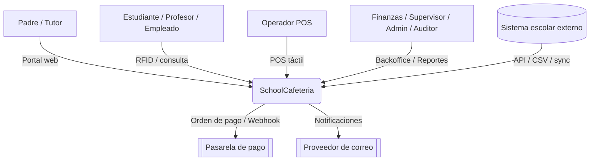
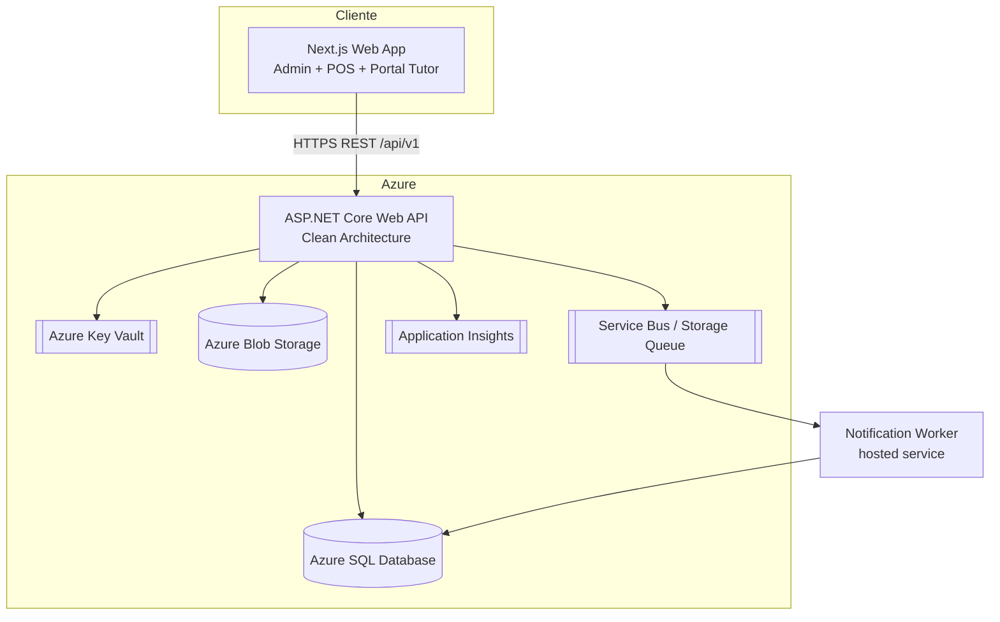
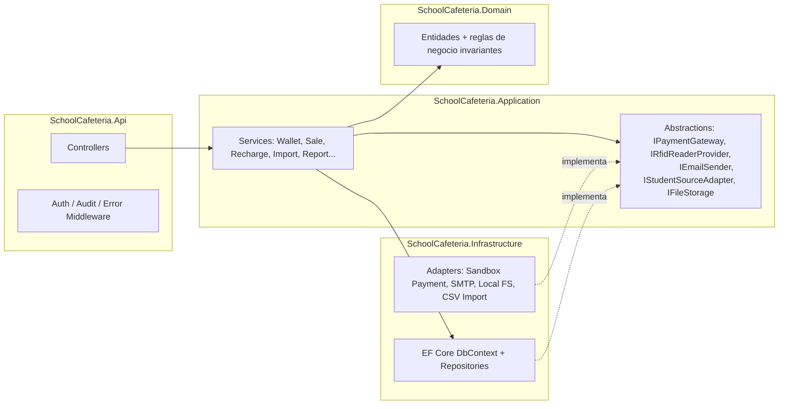
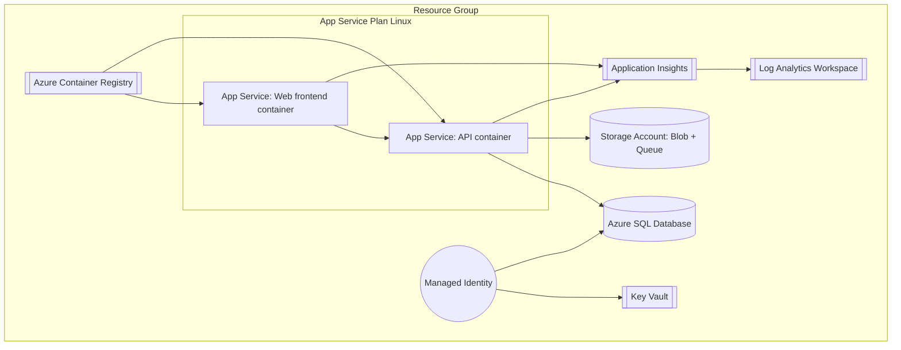

# Fase 2 — Arquitectura

## 1. Diagrama de contexto

## 2. Diagrama de contenedores

## 3. Diagrama de componentes (backend)

La dependencia siempre apunta hacia el **Domain**: Api → Application → Domain,
Infrastructure → Application (implementa sus interfaces) → Domain. Application nunca referencia
Infrastructure ni Api (Clean Architecture / Dependency Inversion).

## 4. Diagrama de despliegue en Azure (opción elegida: App Service con contenedor personalizado)

Alternativa equivalente documentada en `infra/bicep/modules/containerapps.bicep`: **Azure
Container Apps**, útil si se requiere escalado a cero o revisiones/tráfico dividido más
granular. Ambas opciones consumen la misma imagen publicada en ACR.

## 5. Decisiones de arquitectura (ADR resumidas)

| # | Decisión | Justificación |
|---|---|---|
| ADR-1 | Clean Architecture con 4 proyectos (Domain, Application, Infrastructure, Api) | Aísla reglas de negocio de frameworks; testeable sin base de datos real. |
| ADR-2 | Servicios de aplicación explícitos en vez de MediatR | Reduce boilerplate para el alcance del MVP sin perder separación de capas; migrar a CQRS/MediatR es un cambio localizado si se requiere a futuro. |
| ADR-3 | Ledger inmutable de `WalletTransaction` | Cumple regla de negocio: nunca modificar balance sin movimiento; correcciones = transacciones compensatorias. |
| ADR-4 | Concurrencia optimista (`RowVersion`) + transacción de BD con `SERIALIZABLE`/`ReadCommittedSnapshot` en el débito de cartera | Evita condiciones de carrera en compras simultáneas contra la misma cartera. |
| ADR-5 | Outbox de notificaciones en base de datos + `IHostedService` worker | Evita acoplar la confirmación de recarga/venta al éxito de un envío de correo; sustituible por Service Bus real cambiando el adaptador. |
| ADR-6 | JWT propio (con MFA TOTP) como mecanismo principal, con Microsoft Entra ID como puerta de entrada adicional para el personal interno | Entra ID autentica identidad; la autorización sigue resolviéndose siempre contra las tablas `UserRole`/`RolePermission` propias — el backend nunca confía en claims de roles de un token externo. `AuthService.LoginWithEntraIdAsync` valida el ID token contra el documento de descubrimiento OIDC del tenant y emite el mismo JWT propio que el login local, vinculando el `User` por `EntraObjectId` (o por correo la primera vez). Sin tenant real configurado en este build — `EntraId:TenantId`/`ClientId` quedan vacíos por defecto y el botón de login con Microsoft se oculta hasta configurarlos (ver `docs/06-runbook.md`). Tutores y estudiantes no usan Entra ID, solo el login local. |
| ADR-7 | `SchoolId` en toda entidad con alcance de colegio desde el día uno | Prepara multi-tenant futuro sin migración de esquema mayor. |
| ADR-8 | Interfaces con implementación *mock/sandbox* para Pagos, RFID físico, Email, Storage, Fuente de estudiantes externa | Ninguna integración real está definida; se documentan contratos + pruebas de contrato. |

## 6. Estrategia de seguridad

JWT de corta duración (15 min) + refresh token rotativo almacenado hasheado; cookies
`HttpOnly/Secure/SameSite=Strict` para el portal web; RBAC + permisos granulares (tabla
`Permission`/`RolePermission`, no roles hardcodeados en el código de autorización, se usan
policies dinámicas); rate limiting por IP/usuario en login y endpoints financieros; bloqueo
temporal tras intentos fallidos; validación en cliente (Zod) y servidor (FluentValidation /
DataAnnotations); cabeceras de seguridad (HSTS, CSP, X-Content-Type-Options, Referrer-Policy);
secretos vía Key Vault + Managed Identity en Azure, `.env`/`user-secrets` en local; nunca se
loguea contraseña, token, RFID completo o payload de pago — `AuditLog`/logs sanitizan por
convención de nombre de campo.

## 7. Estrategia de integración

Todas las integraciones externas (pagos, correo, RFID físico, storage, sistema escolar) se
acceden únicamente a través de interfaces en `Application/Abstractions`. Infrastructure aporta
la implementación real o mock, seleccionada por configuración (`appsettings` / variables de
entorno) e inyección de dependencias — nunca por `if` en el dominio.

## 8. Estrategia de observabilidad

`/health/live` y `/health/ready` (EF Core + dependencias externas); Application Insights vía
SDK (`ConnectionString` desde Key Vault); `CorrelationId` propagado por middleware y guardado en
`AuditLog`/`WalletTransaction`/`Notification`; logs estructurados (Serilog) con *scopes* por
request; métricas técnicas mínimas (latencia por endpoint, tasa de error, ventas/min).
