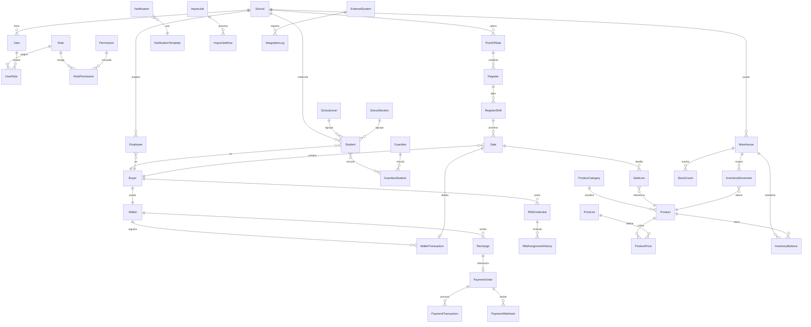

# Modelo de datos

Todas las entidades incluyen `Id (Guid)`, `CreatedAtUtc`, `CreatedBy`, `UpdatedAtUtc`,
`UpdatedBy`, y las que son maestras incluyen `IsDeleted` (soft delete). Las que requieren
aislamiento por colegio incluyen `SchoolId`. Los movimientos financieros y de inventario son
**append-only**: no se exponen operaciones de `DELETE`.

## Entidad-relación (resumen)

## Notas por entidad (índices, unicidad, concurrencia)

- **Student**: único `(SchoolId, StudentCode)`. FK a `SchoolLevel`, `SchoolSection` (nullable).
  `Status ∈ {Active, Inactive, Suspended, Graduated}`.
- **Employee**: único `(SchoolId, EmployeeCode)`.
- **Guardian / GuardianStudent**: `GuardianStudent` es tabla puente con `Relationship`,
  `IsPrimary`, `CanRecharge`, `CanViewHistory`, `CanManageRfid` (permisos de tutor secundario
  configurables por fila, no hardcodeados).
- **Wallet**: único `BuyerId` (1:1). `RowVersion` (concurrencia optimista). `Balance` y
  `HeldBalance` en `decimal(18,2)`. `Status ∈ {Active, Blocked, Closed}`.
- **WalletTransaction**: **inmutable**, índice `(WalletId, CreatedAtUtc)`, único `TransactionNumber`,
  único `IdempotencyKey` cuando no es nulo. `Type ∈ {Recharge, Purchase, Refund, AdjustmentPositive,
  AdjustmentNegative, Reversal, Hold, HoldRelease, Expiration}`. `RelatedTransactionId` autoreferencia
  para reversiones/compensaciones.
- **Recharge**: `Status ∈ {Pending, Processing, Completed, Rejected, Cancelled, Reverted,
  InReconciliation}`. Único `IdempotencyKey`.
- **PaymentOrder/PaymentTransaction/PaymentWebhook**: `PaymentWebhook` guarda el payload crudo +
  firma verificada + único `(Provider, ExternalEventId)` para evitar procesar el mismo evento dos
  veces (regla de negocio: webhook repetido no duplica recarga).
- **RfidCredential**: único índice parcial `(CredentialHashValue) WHERE Status = 'Active'` para
  impedir que una tarjeta activa esté asociada a más de un comprador; el valor completo se
  almacena hasheado (`CredentialHash`), se expone únicamente un `MaskedValue` (`****1234`) en
  API/logs.
- **Product**: único `(SchoolId, Code)`, índice `BarCode`. `ProductPrice` con `ValidFrom/ValidTo`
  — una venta guarda el `UnitPrice` aplicado en `SaleLine`, nunca referencia el precio actual
  (regla: cambios de precio no alteran ventas históricas).
- **Sale/SaleLine**: `Sale.Status ∈ {Completed, Cancelled, Refunded}`. Único
  `(RegisterShiftId, IdempotencyKey)` para evitar doble cobro por doble clic.
- **InventoryBalance**: único `(WarehouseId, ProductId)`, `QuantityOnHand` nunca negativo salvo
  política explícita. **InventoryMovement** es append-only, kardex derivado por suma.
- **AuditLog**: append-only, índice `(EntityName, EntityId, CreatedAtUtc)` y `(UserId,
  CreatedAtUtc)`. Guarda `OldValues`/`NewValues` en JSON excluyendo campos marcados como
  sensibles (`[Sensitive]` en el dominio).
- **SystemSetting**: clave/valor por `SchoolId` (moneda, umbral por defecto, política de saldo
  negativo, etc.), tipado (`string`, `number`, `bool`, `json`).

## Estrategia de auditoría

Interceptor de EF Core (`AuditSaveChangesInterceptor`) captura automáticamente todo `Add
/Modify/Delete` sobre entidades marcadas `IAuditable`, generando un `AuditLog` con valores
antes/después dentro de la **misma transacción** que el cambio de negocio, evitando huecos de
auditoría. Operaciones sensibles adicionales (login, exportaciones, cambio de rol) se auditan
explícitamente desde el servicio de aplicación correspondiente.

## Estrategia de concurrencia

- **Optimista** (`RowVersion`/`xmin`) en `Wallet`, `Product`, `InventoryBalance`, `SystemSetting`.
- **Transaccional con revalidación**: todo movimiento que afecta `Wallet.Balance` o
  `InventoryBalance.QuantityOnHand` se ejecuta dentro de una transacción de base de datos que
  relee el valor actual, valida la regla de negocio (saldo suficiente, stock suficiente) y recién
  entonces escribe — nunca se calcula el nuevo balance fuera de la transacción.
