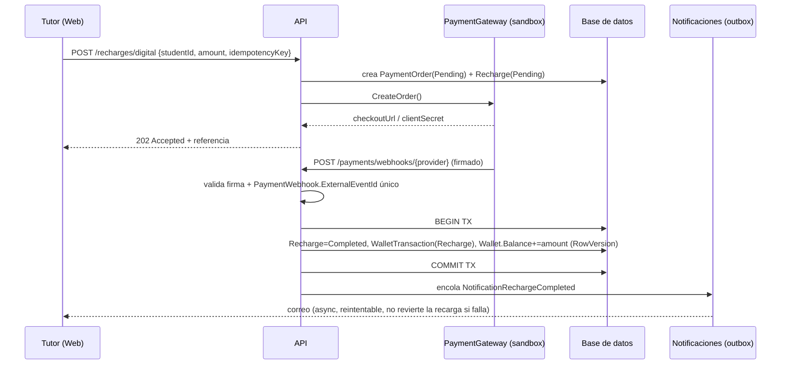
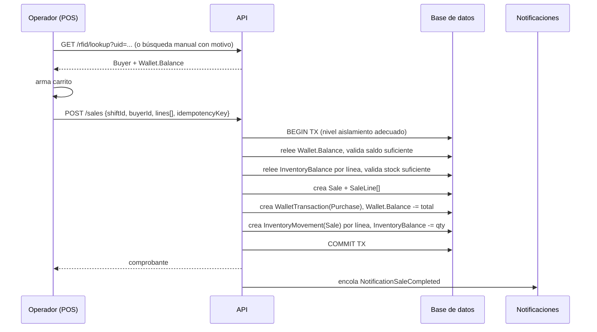

# Flujos críticos

## 1. Recarga digital (tutor)

Idempotencia: `Recharge.IdempotencyKey` único evita doble creación; `PaymentWebhook` único por
`(Provider, ExternalEventId)` evita procesar el mismo webhook dos veces.

## 2. Venta en POS con RFID

Doble clic en "Cobrar": el cliente envía el mismo `IdempotencyKey`; el servidor detecta la
venta ya creada para `(RegisterShiftId, IdempotencyKey)` y devuelve la venta existente en vez de
crear una segunda (idempotencia a nivel de base de datos con índice único).

Fallo parcial: si la validación de inventario falla después de reservar el débito de cartera,
toda la transacción de base de datos se revierte (rollback) — no quedan movimientos parciales.

## 3. Compras simultáneas contra la misma cartera

Dos solicitudes concurrentes de venta sobre el mismo `Wallet` compiten por su `RowVersion`. La
segunda transacción en confirmar detecta el conflicto de concurrencia, relee el balance actual
dentro de su propia transacción y reintenta la validación; si el saldo ya no alcanza, la segunda
venta se rechaza con `409 Conflict` / `422` de negocio, nunca se permite que ambas descuenten
sobre el mismo balance leído en memoria.

## 4. Anulación / devolución

Requiere autorización de Supervisor + motivo obligatorio. Genera:
1. `WalletTransaction(Refund)` compensatorio (nunca se borra la compra original).
2. `InventoryMovement(Return)` que repone stock si corresponde.
3. `AuditLog` con aprobador y motivo.

## 5. Importación masiva de estudiantes

1. Descarga de plantilla → 2. Carga de archivo → 3. `ImportJob` en estado `Validating`,
`ImportJobRow` por fila con `Status ∈ {Valid, Error, Duplicate}` → 4. Vista previa con conteo de
válidas/():errores/duplicados → 5. Confirmación (`create`, `update` o `deactivate` por fila según
configuración) → 6. Ejecución idempotente (clave natural `StudentCode` + `SchoolId`) → 7. Archivo
de resultados descargable + `AuditLog` con el usuario ejecutor.
